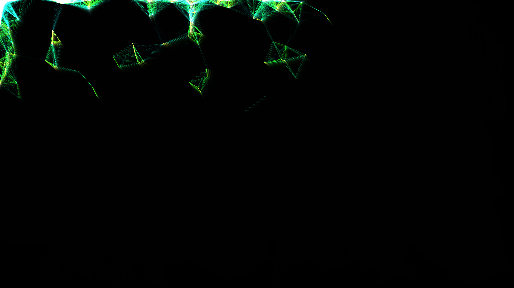

# cybernetic_neural_network_nodes

## Metadata
- **Date**: 2026-05-27
- **Theme**: - **Date**: 2026-05-27 - **Theme**: A dense, glowing network of interconnected nodes resembling a ne
- **Technique**: Unknown
- **Logic Lab Reference**: 

## Concept
- **Date**: 2026-05-27
- **Theme**: A dense, glowing network of interconnected nodes resembling a neural network. Nodes pulse with data and lines connect them based on proximity.
- **Technique**: 2D points bouncing around the canvas with velocity and bounce logic. For every pair of points within a certain distance, a line is drawn connecting them. The line opacity and thickness depend on the distance. Additive blending creates the glowing effect.
- **Description**: An animated 2D cybernetic neural network.

## Technical Details
- **Renderer**: Unknown
- **Simulation**: Unknown
- **Visuals**: Unknown
- **Animation**: Unknown
