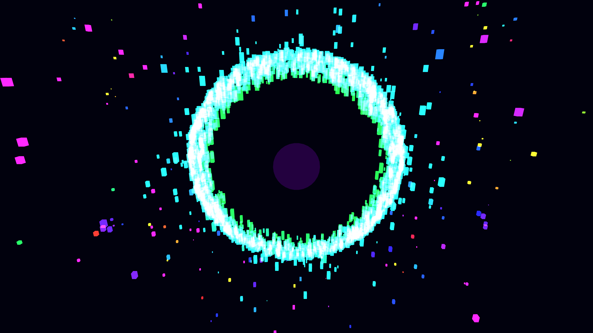

# cybernetic_shard_swarm_gravity_well_3d

## Metadata
- **Date**: 2026-06-07
- **Theme**: A mesmerizing swarm of glowing geometric shards swirling around a central gravity well, moving like 
- **Technique**: A custom particle system with 3000 shards. Each particle calculates gravity towards a central "black hole" core and a swirl force using cross-products to induce a vortex effect. Particles are stretched along their velocity vector. Additive blending and velocity-dependent dynamic coloring create a highly active, kinetic energy field.
- **Logic Lab Reference**: 

## Concept
A mesmerizing swarm of glowing geometric shards swirling around a central gravity well, moving like a school of cybernetic fish.

## Technical Details
- **Renderer**: Unknown
- **Simulation**: Unknown
- **Visuals**: Unknown
- **Animation**: Unknown
