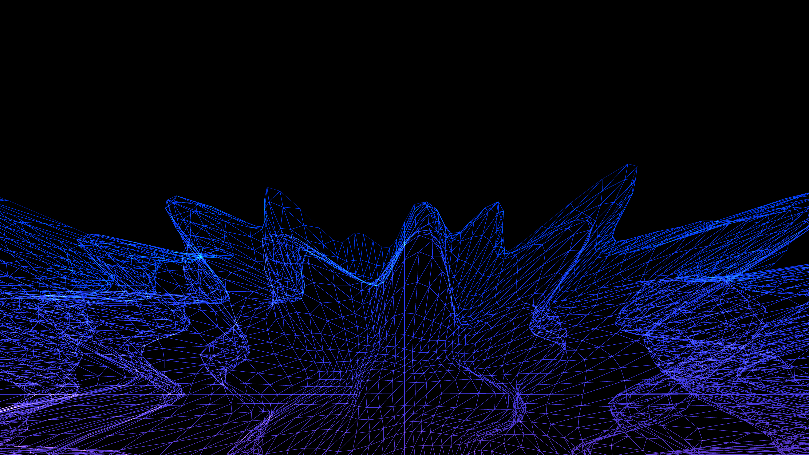

# cybernetic_wireframe_topography

## Metadata
- **Date**: 2026-05-27
- **Theme**: - **Date**: 2026-05-27 - **Theme**: An endless flight over a glowing, neon-wireframe landscape gener
- **Technique**: Unknown
- **Logic Lab Reference**: 

## Concept
- **Date**: 2026-05-27
- **Theme**: An endless flight over a glowing, neon-wireframe landscape generated by procedural 3D Perlin noise. The terrain shifts and morphs, resembling an old-school synthwave cyberspace grid, but with chaotic mountains and valleys.
- **Technique**: A 2D grid of points in 3D space. The Z-height (or Y-height in py5 coords) is determined by `py5.os_noise` with scrolling offsets to simulate flying forward. The grid is drawn as a wireframe mesh with `py5.begin_shape(py5.TRIANGLE_STRIP)`.
- **Description**: A synthwave procedural wireframe terrain generated with Perlin noise.

## Technical Details
- **Renderer**: Unknown
- **Simulation**: Unknown
- **Visuals**: Unknown
- **Animation**: Unknown
