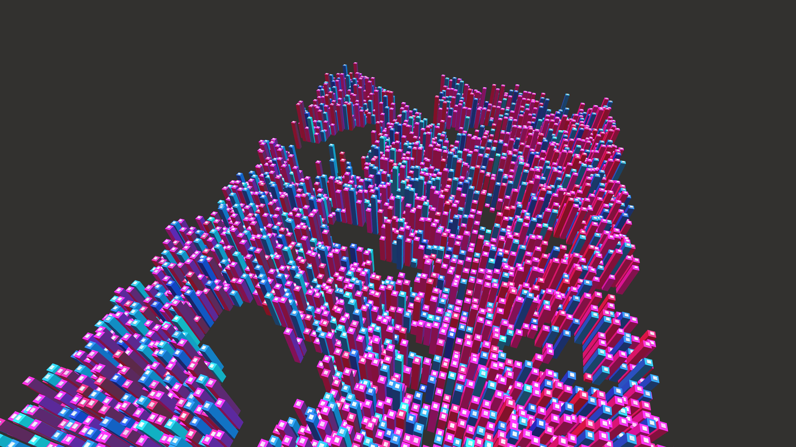

# cyberpunk_isometric_data_cityscape_3d

## Metadata
- **Date**: 2026-06-18
- **Theme**: A 3D isometric animation of a bustling cyberpunk data cityscape
- **Technique**: Rendering a 2D grid of 3D boxes (`py5.box()`) transformed into an isometric projection. The heights of the "buildings" oscillate dynamically using sine waves and Perlin noise. The structures pulse in neon pink, cyan, and deep blue to mimic flowing data lines in a massive metropolis layout.
- **Logic Lab Reference**: 

## Concept
A 3D isometric animation of a bustling cyberpunk data cityscape.

## Technical Details
- **Renderer**: Unknown
- **Simulation**: Unknown
- **Visuals**: Unknown
- **Animation**: Unknown
