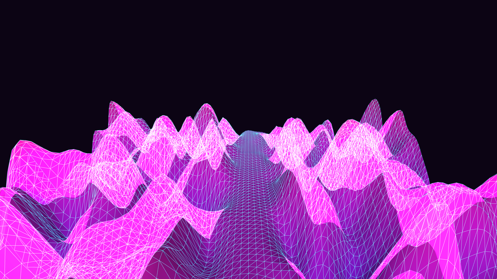

# cyberpunk_neon_terrain_flyover_3d

## Metadata
- **Date**: 2026-05-31
- **Theme**: Generative Art
- **Technique**: A massive 3D grid mapped via `py5.begin_shape(py5.TRIANGLE_STRIP)`. The Z-height of each vertex is governed by 3D OpenSimplex noise. By tracking a circular path through the 2nd and 3rd dimensions of the noise space across frames, the terrain continuously undulates and flows towards the camera while guaranteeing a perfectly seamless 10-second loop.
- **Logic Lab Reference**: 

## Concept
No concept description provided.

## Technical Details
- **Renderer**: Unknown
- **Simulation**: Unknown
- **Visuals**: Unknown
- **Animation**: Contains animation details
