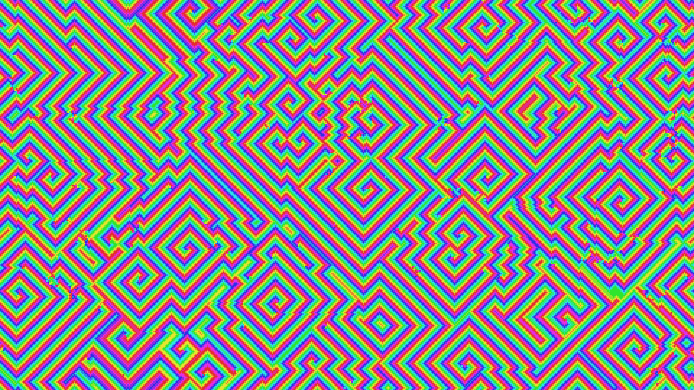

# cyclic_cellular_automata_spirals_2d

## Metadata
- **Date**: 2026-06-16
- **Theme**: A hypnotic, multi-colored cellular automata simulation where multiple species compete in a cyclic ro
- **Technique**: Unknown
- **Logic Lab Reference**: 

## Concept
A hypnotic, multi-colored cellular automata simulation where multiple species compete in a cyclic rock-paper-scissors dynamic, forming mesmerizing spirals and wave fronts.

## Technical Details
- **Renderer**: Unknown
- **Simulation**: Unknown
- **Visuals**: Unknown
- **Animation**: Contains animation details
