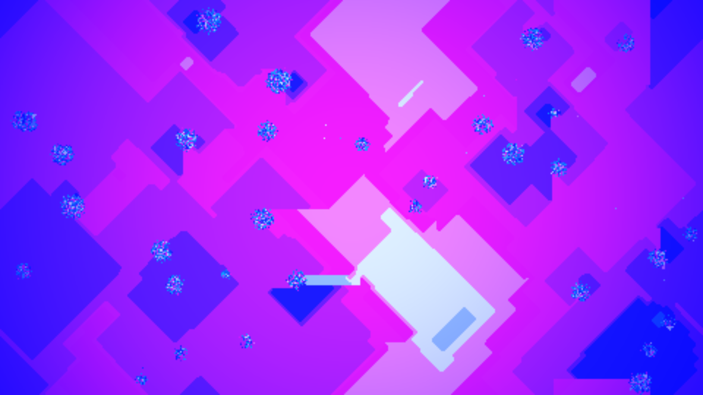

# cyclic_cellular_spirals

## Metadata
- **Date**: 2026-05-30
- **Theme**: A generative digital media art animation depicting expanding, self-organizing geometric spirals in a
- **Technique**: - **Cyclic CA Simulation**: Evolves on a $480 \times 270$ grid scaled up to $3840 \times 2160$ for output. Cells take states $s \in [0, 15]$. A cell transitions from state $s$ to $(s + 1) \pmod{16}$ if it has at least 2 neighbors in that target state. - **Vectorized Update & Rendering**: Shift checks are vectorized in NumPy using `np.roll` for periodic boundary conditions, achieving over 60fps simulation speeds. The cell states are mapped to HSB interpolated RGB colors, multiplied by a cinematic vignette mask, and written directly to a py5 image buffer for high-performance scale rendering. - **Composition & Video**: Compiled at 4K resolution at 60fps with a 10-second duration.
- **Logic Lab Reference**: 

## Concept
A generative digital media art animation depicting expanding, self-organizing geometric spirals in a multi-state cyclic cellular automaton.

## Technical Details
- **Renderer**: Unknown
- **Simulation**: Unknown
- **Visuals**: Unknown
- **Animation**: Contains animation details
