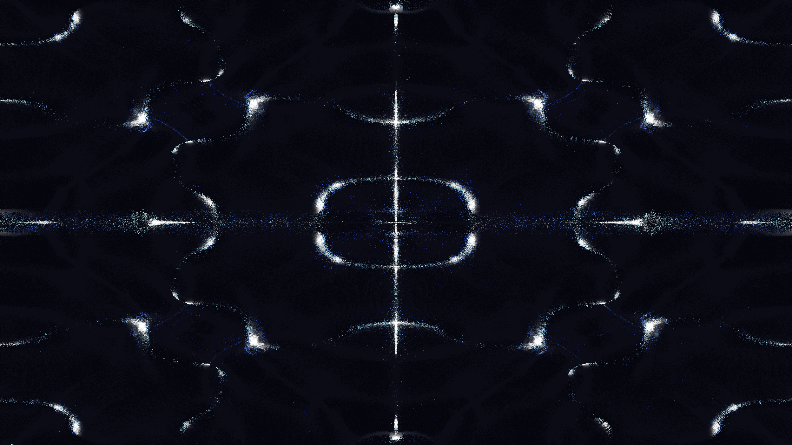

# cymatic_nebula

## Metadata
- **Date**: 2026-05-05
- **Theme**: Cymatics, acoustic trapping, celestial resonance, beautiful night sky.
- **Technique**: 2D grid-based sound pressure simulation (Chladni function), particle advection (80,000 particles) using gradient-descent towards nodal regions, high-persistence silken trails, vectorized additive blending, 60fps high-quality MP4 encoding.
- **Logic Lab Reference**: None

## Concept
A shimmering, silken nebula that self-organizes into complex geometric patterns as if driven by invisible celestial frequencies; glowing filaments in electric indigo and cyan converge into rhythmic standing-wave nodes across a deep, star-dusted void.

## Technical Details
- **Renderer**: P2D
- **Simulation**: particle.
- **Visuals**: additive blending, HSB spectral mapping, persistent trails, bloom-like highlights, prismatic color, dark-field contrast.
- **Animation**: 10 seconds at 60fps
