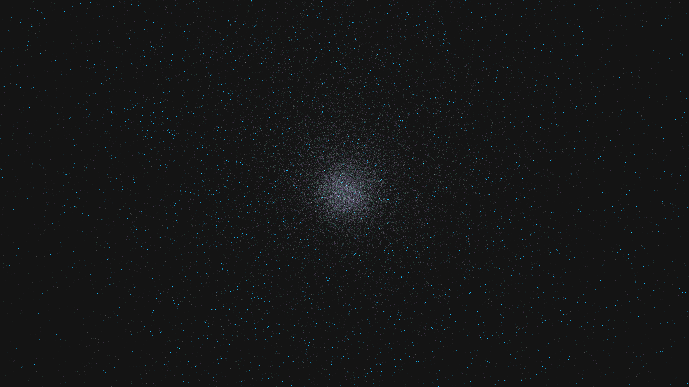

# dark_energy_expansion_drift

## Metadata
- **Date**: 2026-05-09
- **Theme**: Dark energy, quintessence, accelerated expansion, cosmological constant, beautiful night sky.
- **Technique**: 3D simulation of a "quintessence" field using a vectorized 3D scalar field. 120,000 particles representing dark energy quanta are advected by a repulsion field that increases with distance from the center (exponential expansion). Particles undergo virtual decay and leave silken threads. Multi-pass additive rendering with a "Cosmic Lavender/Deep Emerald/Silver" palette and a high-density background starfield. 60fps high-bitrate MP4.
- **Logic Lab Reference**: None

## Concept
A majestic visualization of the accelerating expansion of the universe; silken threads of cosmic lavender and deep emerald light stretch and thin as they drift into the obsidian night, representing the hidden energy driving the cosmos apart.

## Technical Details
- **Renderer**: P3D
- **Simulation**: particle.
- **Visuals**: additive blending, dark-field contrast.
- **Animation**: 15 seconds at 60fps
