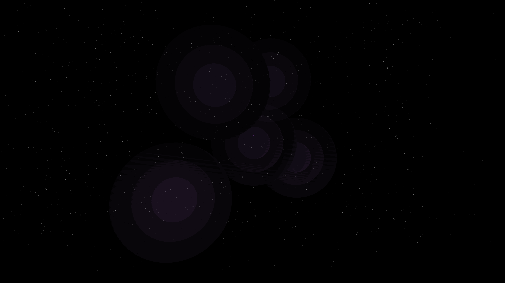

# dark_matter_halo

## Metadata
- **Date**: 2026-05-06
- **Theme**: Dark matter, cosmic web, gravitational lensing, beautiful night sky.
- **Technique**: 3D particle simulation (120,000 particles) representing the "cosmic web". Particles aggregate into filaments and halos using hub-based attraction. Features a "gravitational lensing" effect where 4,500 background stars are dynamically distorted by the invisible mass of the hubs. Multi-pass rendering with soft, ethereal "halo" glows and ghost-like particle filaments. 60fps high-bitrate MP4 encoding.
- **Logic Lab Reference**: None

## Concept
A haunting visualization of the universe's hidden architecture; faint, ghostly filaments of ghostly amethyst and cobalt energy weave through the void, while the light from distant stars is warped and bent by the immense, invisible mass of the dark matter halos.

## Technical Details
- **Renderer**: P3D
- **Simulation**: particle, 3D particle.
- **Visuals**: HSB spectral mapping, bloom-like highlights, prismatic color, dark-field contrast.
- **Animation**: 10 seconds at 60fps
