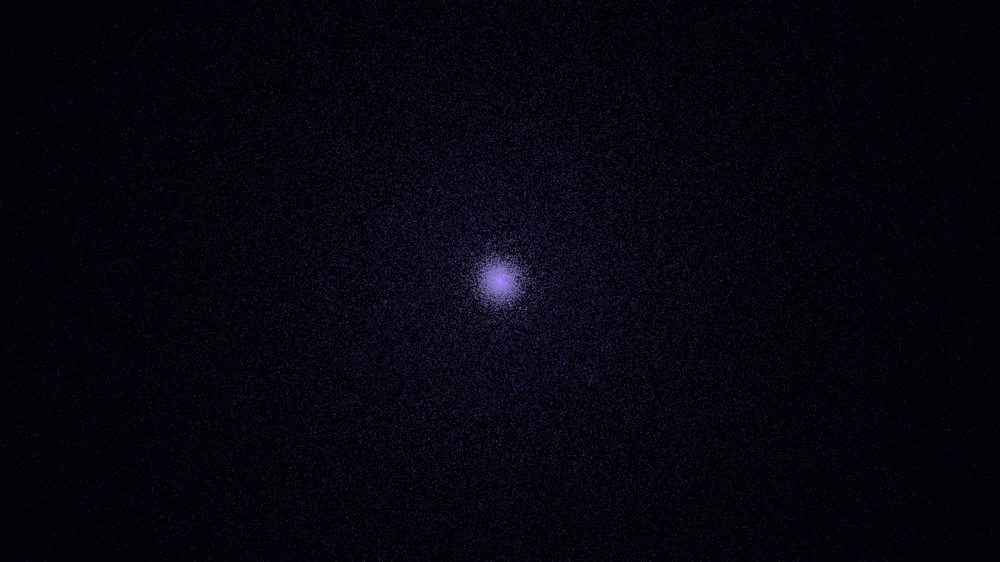

# dark_matter_halo_cusp

## Metadata
- **Date**: 2026-05-12
- **Theme**: Astrophysics, dark matter, N-body simulation, NFW profile, gravitational collapse.
- **Technique**: 3D N-body simulation (140,000 particles) with NFW potential modeling. Multi-pass additive rendering. 20s 4K/60fps MP4 (1080p source).
- **Logic Lab Reference**: None

## Concept
A diffuse cloud of Spectral Indigo particles collapses into a dense, bright central cusp, visualizing the formation of a dark matter halo.

## Technical Details
- **Renderer**: P3D
- **Simulation**: particle.
- **Visuals**: additive blending, HSB spectral mapping, bloom-like highlights, prismatic color, dark-field contrast.
- **Animation**: 20 seconds at 60fps
