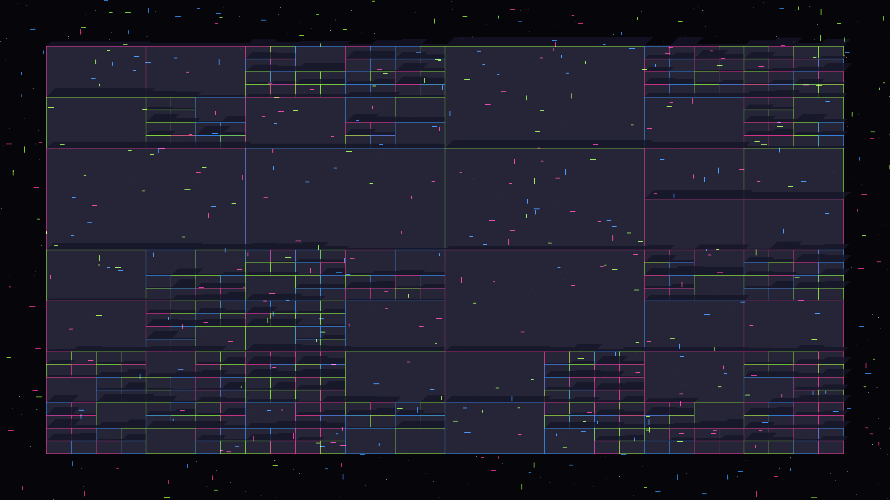

# data_metropolis

## Metadata
- **Date**: 2026-05-05
- **Theme**: Digital urbanism, data flow, quantum connectivity, beautiful night sky.
- **Technique**: Recursive quadtree subdivision, isometric building projection, Manhattan-grid particle advection (data packets), spectral edge highlighting.
- **Logic Lab Reference**: None

## Concept
A top-down isometric view of a digital metropolis where luminous data packets in laser pink, cyber lime, and electric blue surge through a complex geometric grid; the architectural slabs of the city pulse with neon light against a star-dusted night sky.

## Technical Details
- **Renderer**: P2D
- **Simulation**: particle, recursive.
- **Visuals**: HSB spectral mapping, prismatic color, dark-field contrast.
- **Animation**: 10 seconds at 60fps
