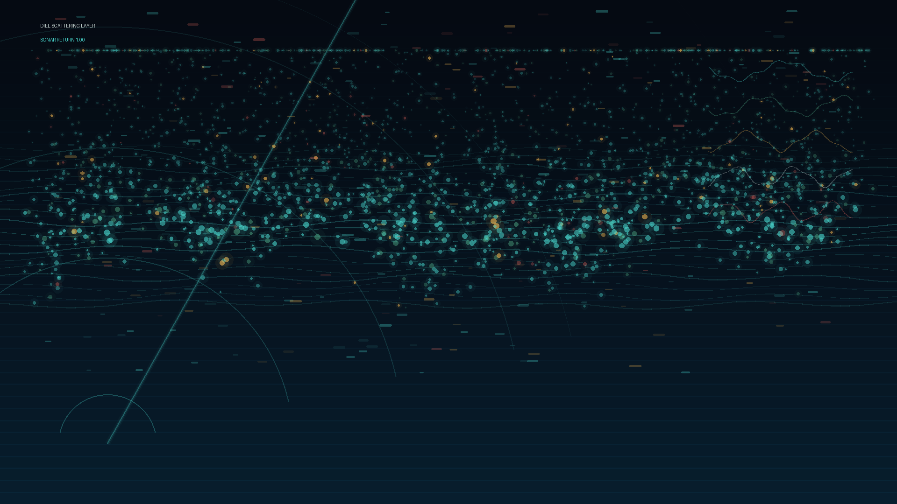

# diel_migration_sonar

## Metadata
- **Date**: 2026-05-26
- **Theme**: Generative Art
- **Technique**: This 10-second 60fps animation uses a procedural sonar display: thousands of drifting organisms follow a seamless vertical migration curve, density bands fold through sine-driven currents, and acoustic sweep rings reveal the layer in pulses. Small diagnostic traces and restrained amber/coral signals keep the piece legible without washing the image to white.
- **Logic Lab Reference**: 

## Concept
No concept description provided.

## Technical Details
- **Renderer**: Unknown
- **Simulation**: Unknown
- **Visuals**: Unknown
- **Animation**: Contains animation details
