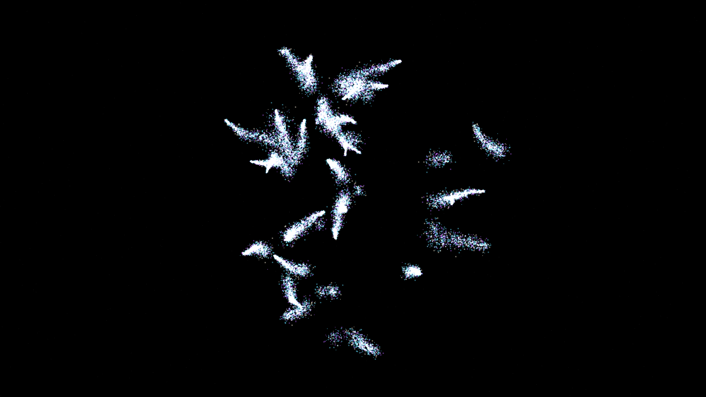
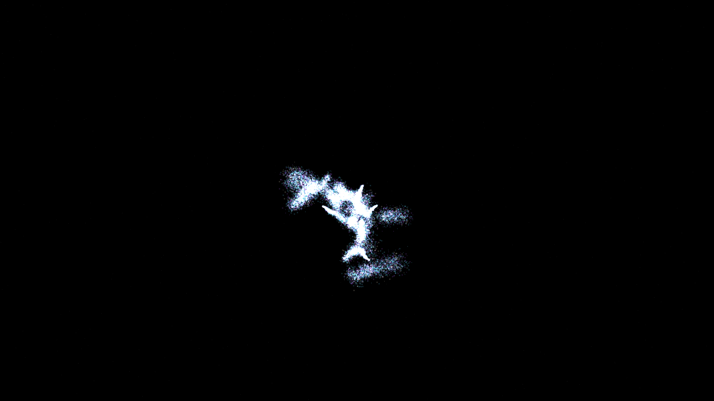

# dielectric_breakdown_resonance

### Previews
- **Original 1080p:**
  
- **Upgraded 4K:**
  

## Metadata
- **Date**: 2026-05-11
- **Theme**: Plasma physics, Lichtenberg figures, dielectric breakdown, high-voltage discharge, beautiful night sky.
- **Technique**: 3D stochastic branch-growth simulation (DLA-variant) where "streamers" propagate along the gradient of a dynamic field. Features 30,000 spectral particles advected by the local discharge current and turbulence. Rendered with manual 3D-to-2D projection, multi-pass additive blending, and a "Blinding White / Electric Cyan / Deep Amethyst" palette. 8s 4K/60fps MP4.
- **Logic Lab Reference**: None

## Concept
A majestic, high-energy visualization of cosmic lightning; razor-sharp branches of electric cyan and white energy strike out into the obsidian void, shattering into a shimmering haze of amethyst particles as the dielectric strength of the vacuum fails.

## Technical Details
- **Renderer**: P2D
- **Simulation**: particle, DLA.
- **Visuals**: additive blending, HSB spectral mapping, bloom-like highlights, prismatic color, dark-field contrast.
- **Animation**: 8 seconds at 60fps
