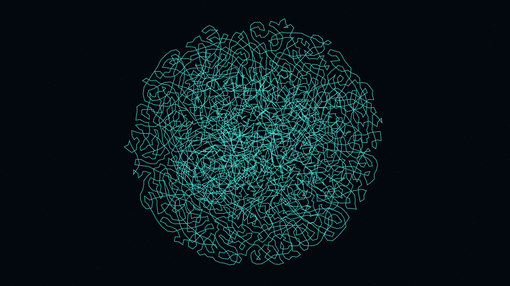

# differential_expansion

An organic, brain-like structure that folds and expands through a differential growth algorithm.

## Description

This work simulates organic morphogenesis where a closed loop of nodes expands and subdivides while maintaining a minimum proximity to all other nodes. This "differential growth" creates complex, brain-like or coral-like folds that shimmer with bioluminescent highlights of seafoam and cyan against a deep oceanic void.

## Details

- **Date**: 2026-05-05
- **Theme**: Organic morphogenesis, brain-like folding, cellular growth, beautiful night sky
- **Technique**: 
  - Differential growth algorithm (Verlet-integrated nodes)
  - Scipy KDTree spatial repulsion optimization for high performance
  - Multi-layered bioluminescent rendering (Emerald/Seafoam/Cyan)
  - Additive blending for glow effects
  - Dense twinkling starfield
- **Output**: 10s animation @ 60fps (3840x2160)

## Preview

## Animation

[output.mp4](output.mp4)
