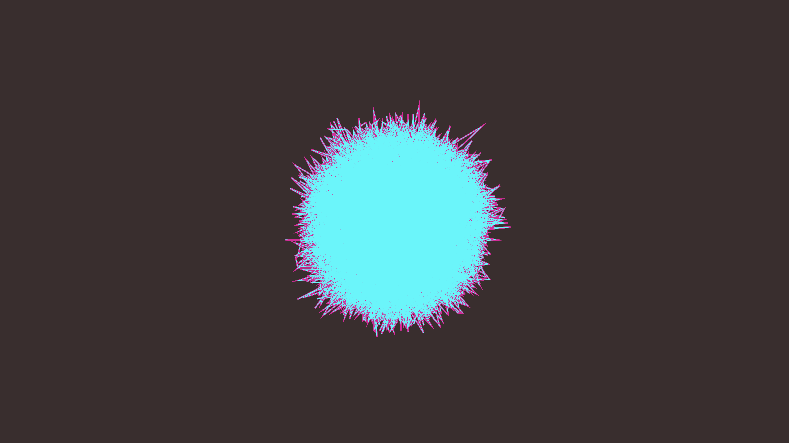

# differential_growth_coral

An organic, meandering brain-coral structure that grows and folds continuously over itself.

## Details

- **Date**: 2026-05-31
- **Theme**: An organic, meandering brain-coral structure that grows and folds continuously over itself.
- **Technique**: Differential Growth Algorithm. A closed loop of points grows continuously by splitting when edges get too long. Points repel each other using `scipy.spatial.cKDTree` for lightning-fast radius searches, forcing the curve to fold into complex, brain-coral-like meandering patterns.
- **Palette**: Deep space background with a glowing cyan core and pinkish neon halos.

## Previews



## Usage

```bash
uv run python main.py
```
