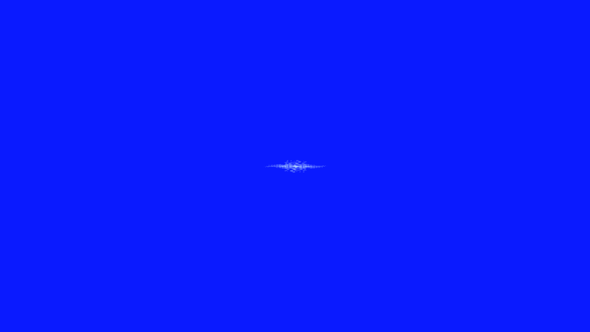

# diffraction_pattern

## Metadata
- **Date**: 2026-04-29
- **Theme**: optics, wave physics, interference, diffraction, mathematical precision.
- **Technique**: Fraunhofer diffraction simulation using Fourier transform principles, 2D FFT for far-field diffraction patterns, multiple aperture types (circular, rectangular, double slit).
- **Logic Lab Reference**: None

## Concept
Wave interference patterns revealed through Fraunhofer diffraction; concentric diffraction rings and interference fringes created by light passing through apertures, demonstrating the wave nature of light with mathematical precision.

## Technical Details
- **Renderer**: P2D
- **Simulation**: FFT.
- **Visuals**: bloom-like highlights, dark-field contrast.
- **Animation**: Still image
