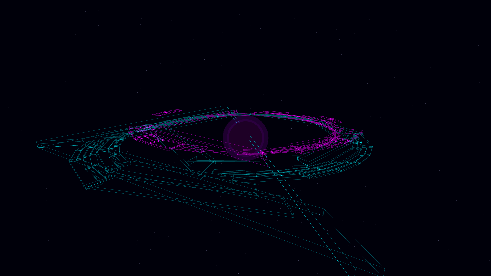

# digital_accretion_singularity

## Metadata
- **Date**: 2026-05-06
- **Theme**: Data singularity, black hole accretion, high-tech urbanism, beautiful night sky.
- **Technique**: 3D accretion disk visualization using polar quadtree subdivision to generate a spiraling digital metropolis. Blocks accelerate and heat up (shifting from Cyan to Magenta) as they fall towards a central event horizon. Features relativistic coordinate warping, additive wireframe rendering, a volumetric singularity glow, and a high-density background starfield. 60fps high-bitrate MP4.
- **Logic Lab Reference**: None

## Concept
A majestic vision of a data-singularity; a vast, glowing grid of information and architectural geometry is shredded and consumed by an invisible abyss, pulsing with spectral energy against the deep obsidian night.

## Technical Details
- **Renderer**: P3D
- **Simulation**: 3D accretion disk visualization using polar quadtree subdivision to generate a spiraling digital metropolis.
- **Visuals**: additive blending, HSB spectral mapping, bloom-like highlights, prismatic color, dark-field contrast.
- **Animation**: 10 seconds at 60fps
