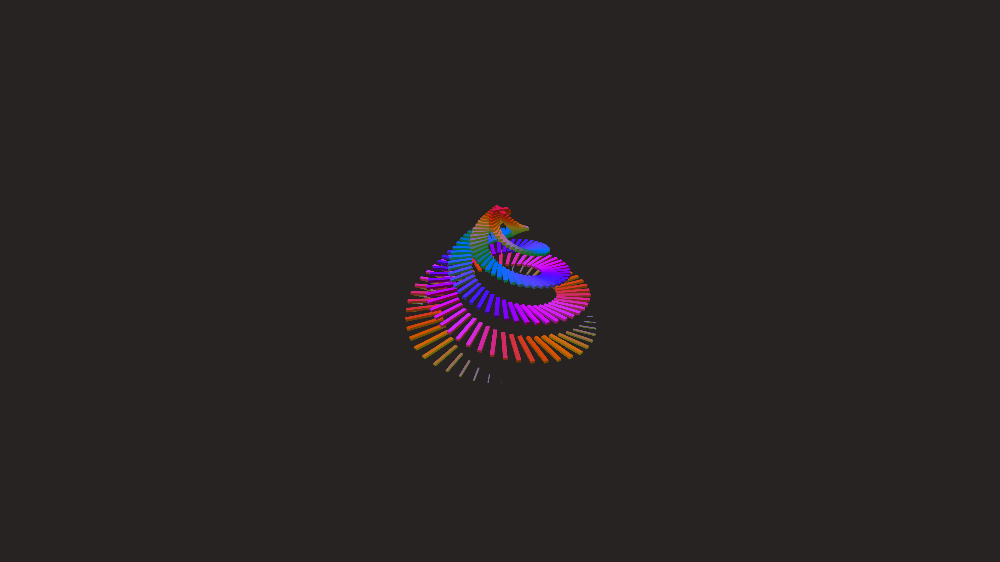

# digital_bismuth_crystal_growth_3d

## Metadata
- **Date**: 2026-06-18
- **Theme**: A 3D animation of geometric bismuth crystals growing, featuring iridescent, rainbow-colored stepped 
- **Technique**: Using 3D boxes (`py5.box()`) stacked in a spiral staircase pattern to mimic bismuth's hopper crystal growth. The color shifts through the HSB spectrum over time and space to mimic the oxide layer iridescence. Camera slowly rotates around the growing formation as lighting enhances the structural depth and color shift.
- **Logic Lab Reference**: 

## Concept
A 3D animation of geometric bismuth crystals growing, featuring iridescent, rainbow-colored stepped terraces and right-angle formations.

## Technical Details
- **Renderer**: Unknown
- **Simulation**: Unknown
- **Visuals**: Unknown
- **Animation**: Unknown
