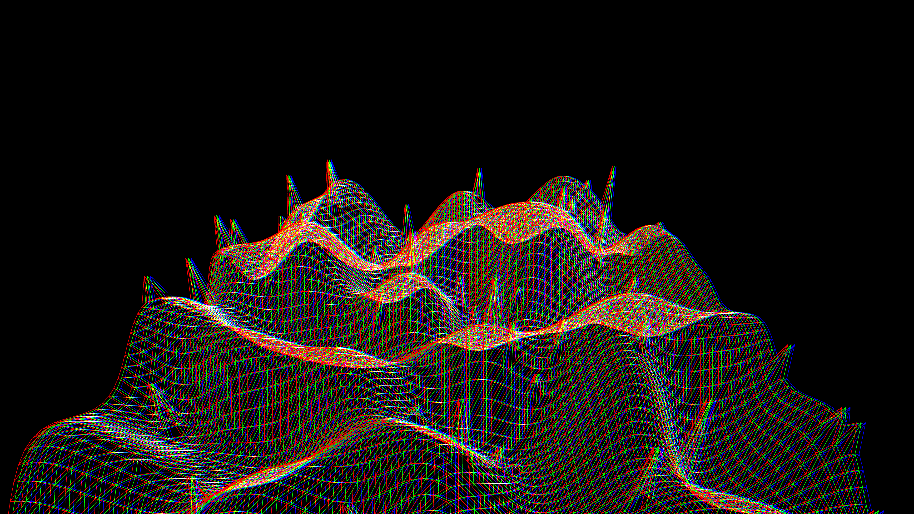

# digital_glitch_topography

## Metadata
- **Date**: 2026-05-27
- **Theme**: - **Date**: 2026-05-27 - **Theme**: A digital, retro-cyberpunk corrupted landscape
- **Technique**: Unknown
- **Logic Lab Reference**: 

## Concept
- **Date**: 2026-05-27
- **Theme**: A digital, retro-cyberpunk corrupted landscape. A wireframe grid terrain flies toward the camera. Extreme high-frequency noise causes sharp, jagged spikes resembling data corruption.
- **Technique**: A 3D grid with Z-height driven by low-frequency noise (hills) combined with a high-frequency noise threshold (spikes). The scene uses additive blending to create chromatic aberration (red, green, blue color channels offset).
- **Description**: An animated 3D digital glitch topography.

## Technical Details
- **Renderer**: Unknown
- **Simulation**: Unknown
- **Visuals**: Unknown
- **Animation**: Unknown
