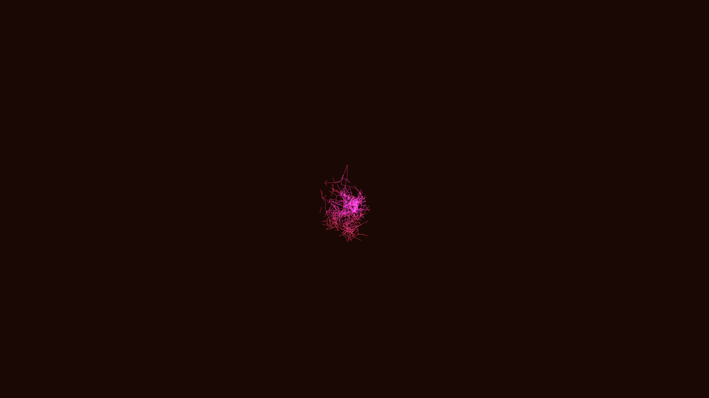

# digital_mycelium_network_3d

## Metadata
- **Date**: 2026-05-28
- **Theme**: An animated 3D network of growing digital mycelium using random walk / differential growth algorithm
- **Technique**: Unknown
- **Logic Lab Reference**: 

## Concept
An animated 3D network of growing digital mycelium using random walk / differential growth algorithm.

## Technical Details
- **Renderer**: Unknown
- **Simulation**: Unknown
- **Visuals**: Unknown
- **Animation**: Unknown
