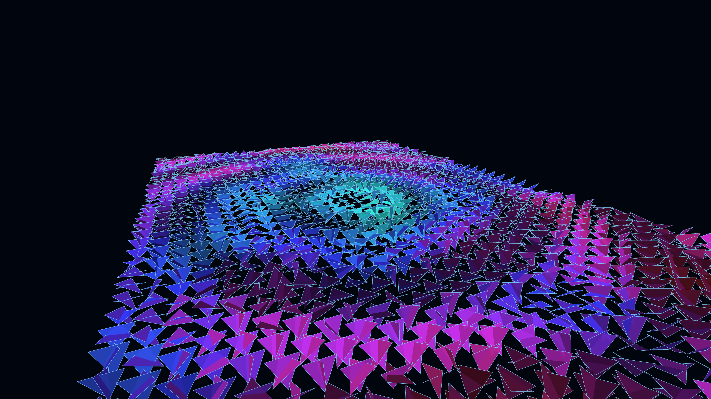

# digital_origami_tessellation_morph_3d

## Details
- **Date**: 2026-06-05
- **Format**: Animation (12s @ 60fps)
- **Theme**: A 3D field of glowing digital origami triangles that continuously fold, unfold, and tessellate into complex geometries, resembling a shifting cybernetic landscape.

## Technique
A procedurally generated hexagonal grid where each cell is broken into triangular faces. The faces continuously fold and rotate on their edges driven by 2D simplex noise and a simulated ripple over a 3D terrain.

