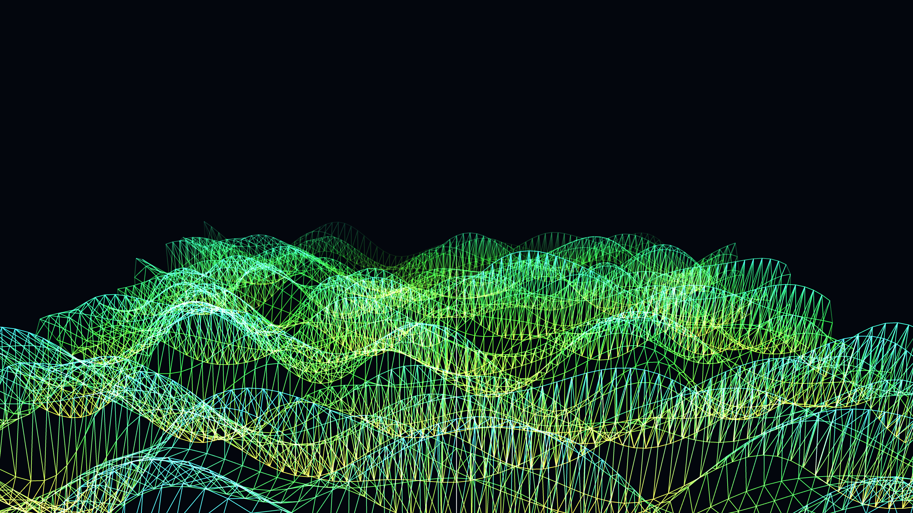

# digital_wireframe_sand_dunes_3d

A minimalist landscape of rolling sand dunes made entirely of glowing digital wireframes that shift endlessly like a desert swept by a data storm.

## Technique

A triangle strip mesh is rendered over a grid. The Z-height of each vertex is determined by a moving 3D OpenSimplex noise field, giving the illusion of flying over shifting dunes. The wireframes fade into the distance via alpha mapping, and colors gently shift over time.
