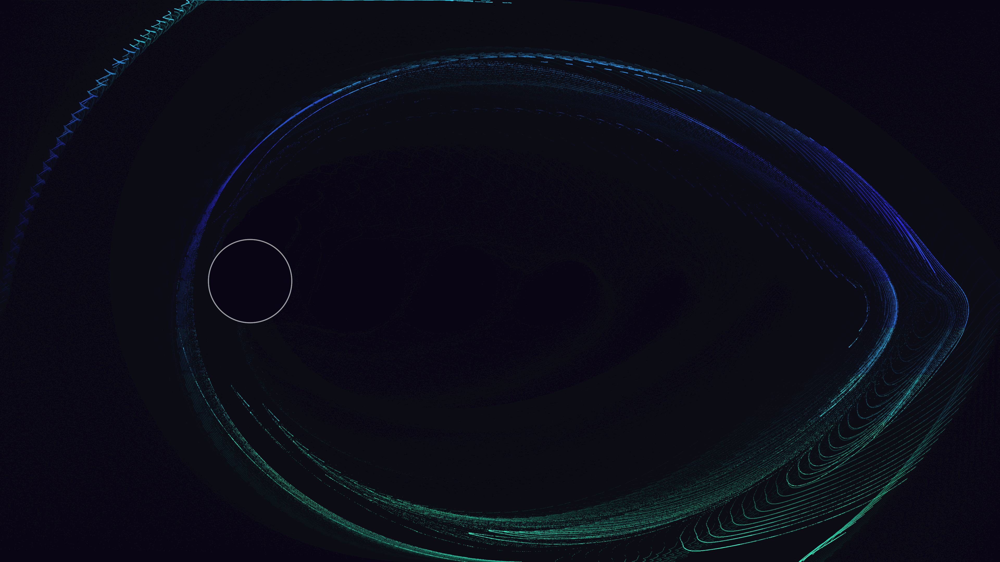

# dirac_fluid_turbulence

## Metadata
- **Date**: 2026-05-12
- **Theme**: Dirac fluids, electron hydrodynamics, graphene physics, relativistic turbulence.
- **Technique**: 2D particle advection on a velocity field (80,000 particles). Velocity field generated by a von Kármán vortex street model. Multi-pass additive rendering. 14s 4K/60fps MP4 (1080p source).
- **Logic Lab Reference**: None

## Concept
A shimmering flow of plasma-like light surges through a channel, breaking into a majestic von Kármán vortex street of glowing eddies as it encounters a circular obstacle.

## Technical Details
- **Renderer**: P2D
- **Simulation**: particle.
- **Visuals**: additive blending, dark-field contrast.
- **Animation**: 10 seconds at 60fps
