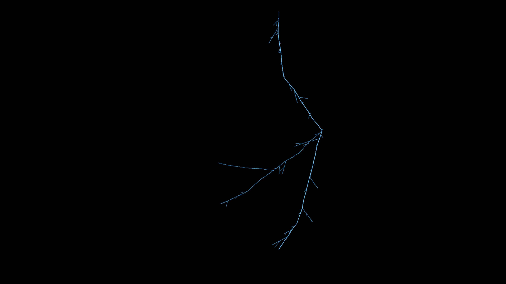

# dla_lightning

## Metadata
- **Date**: 2026-04-26
- **Theme**: electricity, physics, branching fractal, nature.
- **Technique**: midpoint displacement fractal with stochastic branching, numpy glow accumulation, log-scale tone mapping.
- **Logic Lab Reference**: None

## Concept
A single lightning bolt rendered via recursive midpoint displacement — each segment splits at a randomly displaced midpoint, spawning side branches with depth-weighted probability; depth encodes color from near-white core to dim steel-blue tips.

## Technical Details
- **Renderer**: P2D
- **Simulation**: NumPy.
- **Visuals**: bloom-like highlights, dark-field contrast.
- **Animation**: Still image
