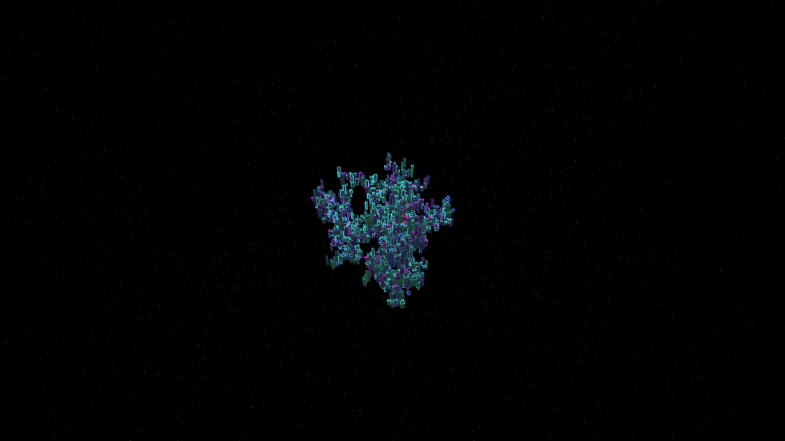

# dla_metropolis

## Metadata
- **Date**: 2026-05-06
- **Theme**: Organic urbanism, diffusion-limited aggregation (DLA), brutalist megastructures, beautiful night sky.
- **Technique**: 3D Diffusion-Limited Aggregation (DLA) simulation (3,200 monoliths) using a NumPy-optimized spatial hashing grid for fast particle collision. Monoliths are rendered with skyscraper proportions and multi-pass aesthetics: (1) Solid obsidian core (BLEND), (2) Neon edge highlights (ADD), and (3) Subtle volumetric glow (ADD). HSB palette (Cyan/Indigo/Magenta) with a twinkling starfield backdrop. 60fps high-bitrate MP4.
- **Logic Lab Reference**: None

## Concept
A vast, fractal-like megacity grown through organic aggregation in the deep void; thousands of obsidian skyscrapers with glowing neon edges form a dense, bristling monolith that pulses with digital life against a silent, star-dusted night.

## Technical Details
- **Renderer**: P3D
- **Simulation**: NumPy, particle, DLA.
- **Visuals**: HSB spectral mapping, bloom-like highlights, dark-field contrast.
- **Animation**: 10 seconds at 60fps
