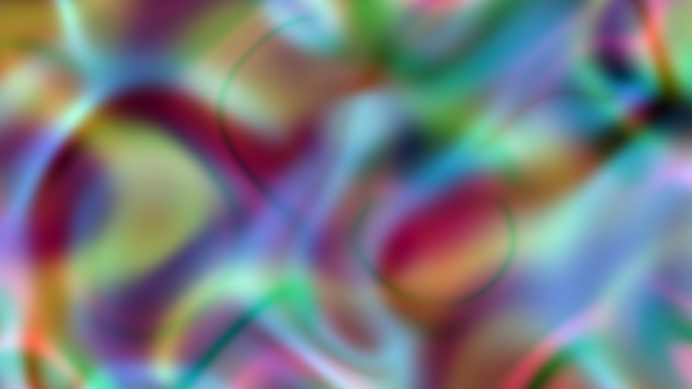

# Domain Warp

Three independent coordinate-warp chains distort a 2D mathematical field through successive sine/cosine transformations, then sample harmonic functions of the warped positions for each color channel. Random phase and frequency parameters are chosen fresh each run, producing a unique abstract color field every time — swirling organic forms with no natural referent.
