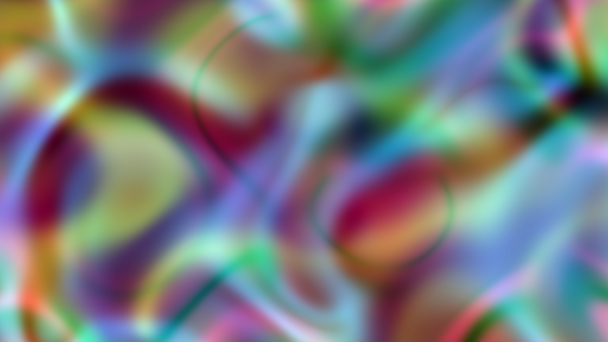

# domain_warp

## Metadata
- **Date**: 2026-04-25
- **Theme**: pure abstraction, mathematics, generative color.
- **Technique**: iterative domain warping, multi-chain coordinate distortion, harmonic sampling, numpy vectorization.
- **Logic Lab Reference**: None

## Concept
Three independent warp chains distort a 2D field through layered sine/cosine transformations; randomized parameters produce a unique abstract color swirl on every run.

## Technical Details
- **Renderer**: P2D
- **Simulation**: NumPy.
- **Visuals**: bloom-like highlights, dark-field contrast.
- **Animation**: Still image
