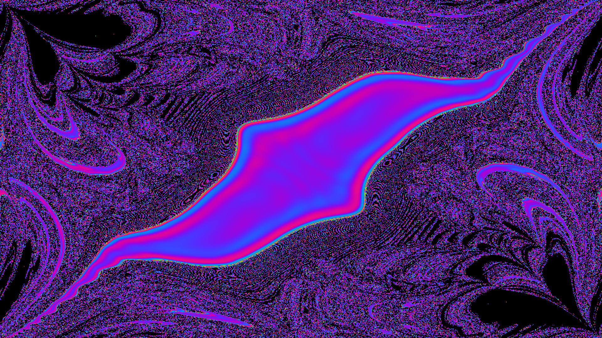

# double_pendulum_fractal_map

## Metadata
- **Date**: 2026-05-23
- **Theme**: The fractal nature of chaos, mapped by hundreds of thousands of double pendulums simulated simultane
- **Technique**: Unknown
- **Logic Lab Reference**: 

## Concept
The fractal nature of chaos, mapped by hundreds of thousands of double pendulums simulated simultaneously.

- **Date**: 2026-05-23
- **Theme**: Chaos theory, fractal boundaries, double pendulum, phase space.
- **Technique**: A 2D parameter space grid (where $X = \theta_1$ and $Y = \theta_2$) represents the initial starting angles of over 500,000 double pendulums. A highly vectorized NumPy physics engine integrates the equations of motion for all pendulums simultaneously using a sub-stepped Euler/Runge-Kutta approximation. The current angle $\theta_2$ of each pendulum is mapped to a continuous spectral color map, creating an intricately folding fractal that reveals the chaotic boundaries of the system over time. 15s 60fps MP4.
- **Description**: A smooth, beautifully colored gradient gradually warps, stretches, and folds in upon itself with infinite complexity. As the hidden pendulums swing, the phase space shatters into a breathtaking, swirling fractal pattern, perfectly visualizing how microscopic changes in initial conditions lead to wildly divergent and chaotic futures.

## Technical Details
- **Renderer**: Unknown
- **Simulation**: Unknown
- **Visuals**: Unknown
- **Animation**: Contains animation details
