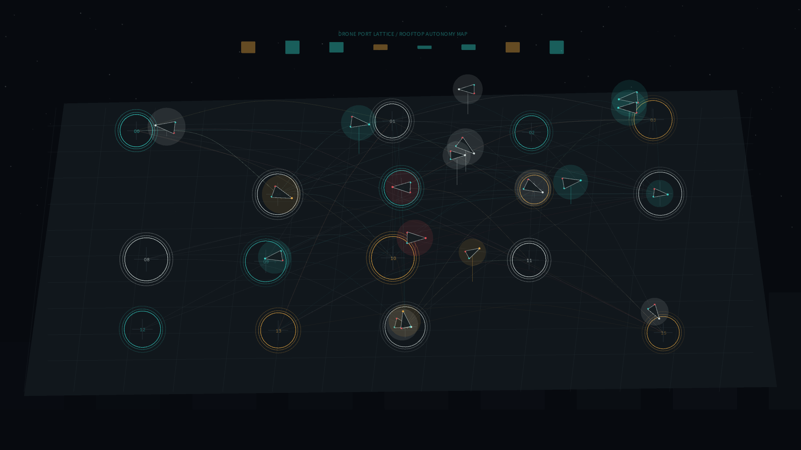

# drone_port_lattice

## Metadata
- **Date**: 2026-05-19
- **Theme**: A rooftop drone-port network negotiating quiet autonomous arrivals under a dark city sky.
- **Technique**: Routed flight-arc animation with stochastic landing pads, easing-based drone interpolation, pad occupancy pulses, parallax skyline layers, and aviation-light accents.
- **Logic Lab Reference**: None

## Concept
`drone_port_lattice` imagines a near-future rooftop as a calm air-traffic drawing. Charging pads pulse with status, routes hang above the roof as faint arcs, and small autonomous craft move between landing points like precise navigation marks rather than spectacle.

## Technical Details
- **Renderer**: P2D
- **Simulation**: Procedural route graph with multi-stop drone paths and eased segment interpolation
- **Visuals**: Graphite rooftop grid, teal/amber/silver pad rings, red and cyan navigation lights, faint skyline depth
- **Animation**: 10 seconds at 60fps, generating `output.mp4` and `drone_port_lattice_p1.png`
