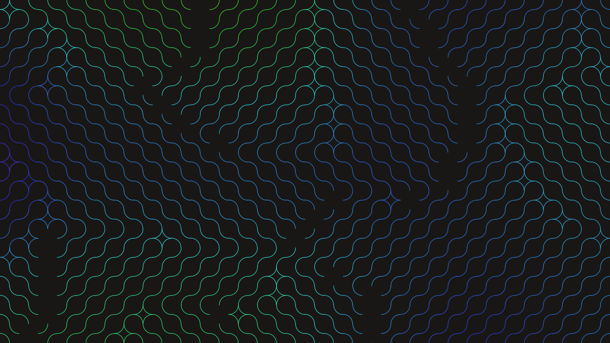

# dynamic_truchet_maze_cpu

## Metadata
- **Date**: 2026-05-31
- **Theme**: Generative Art
- **Technique**: Animated multi-scale Truchet tiles. Using arcs on a grid where each cell rotates by 90 degrees based on a spatial noise field that shifts over time.
- **Logic Lab Reference**: 

## Concept
No concept description provided.

## Technical Details
- **Renderer**: Unknown
- **Simulation**: Unknown
- **Visuals**: Unknown
- **Animation**: Contains animation details
