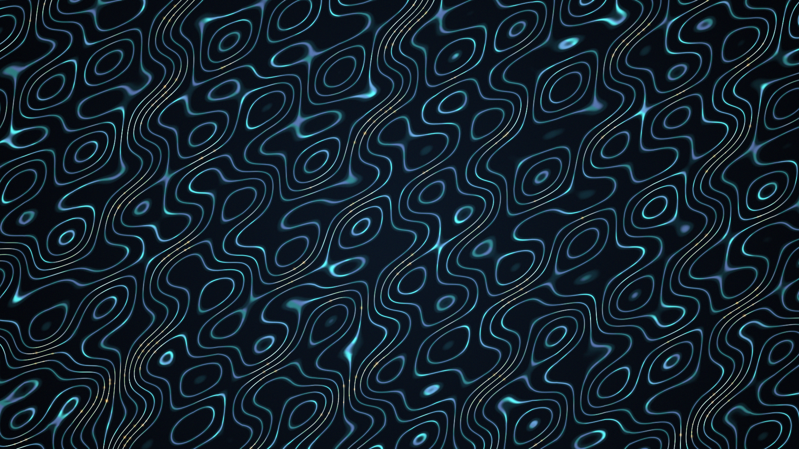

# eigenveil

## Metadata
- **Date**: 2026-05-03
- **Theme**: hidden order, woven abstraction, spectral pressure, quiet machinery
- **Technique**: Weighted graph Laplacian eigenmodes, bilinear field expansion, quantized contour threading, gradient-based stress accents

## Concept
A dark full-canvas veil of teal and violet contour threads reveals hidden mathematical pressure beneath the surface; restrained amber points flicker along steep spectral bends without exposing the underlying graph directly.

## Technical Details
- **Renderer**: P2D
- **Simulation**: Weighted graph Laplacian eigenmodes
- **Visuals**: bilinear field expansion, quantized contour threading, gradient-based stress accents
