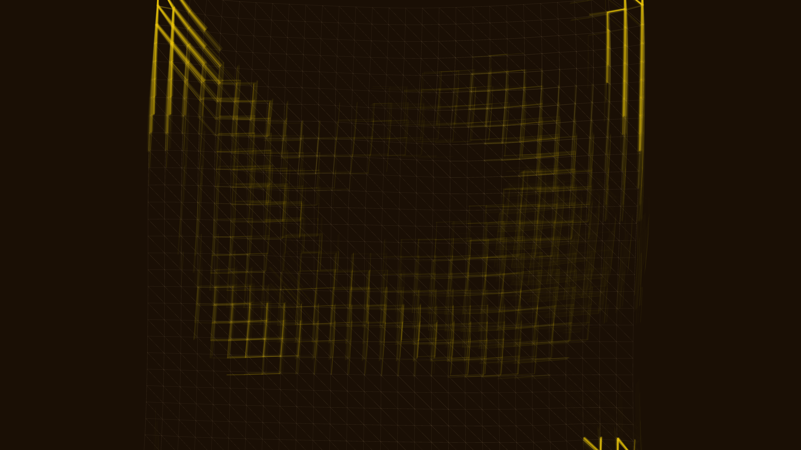

# elastic_residue

## Metadata
- **Date**: 2026-05-04
- **Theme**: Material memory, physical tension, lingering traces, soft-body abstraction
- **Technique**: Verlet cloth simulation (30x30 mesh), persistence-buffer trail accumulation, tension-weighted spectral coloring (Tan→Gold), multi-agent repulsion field
- **Logic Lab Reference**: `research/cloth_simulation/cloth_simulation.py` — used for Verlet integration and constraint satisfaction logic

## Concept
A luminous web of threads deforms under invisible pressure, leaving a persistent golden record of its peak tension; the dark sienna background holds the "scars" of past movements, creating a complex palimpsest of physical stress and slow recovery.

## Technical Details
- **Renderer**: P2D
- **Simulation**: Verlet cloth simulation (30x30 mesh)
- **Visuals**: persistence-buffer trail accumulation, tension-weighted spectral coloring (Tan→Gold), multi-agent repulsion field
- **Animation**: 10s @ 60fps (typical)
