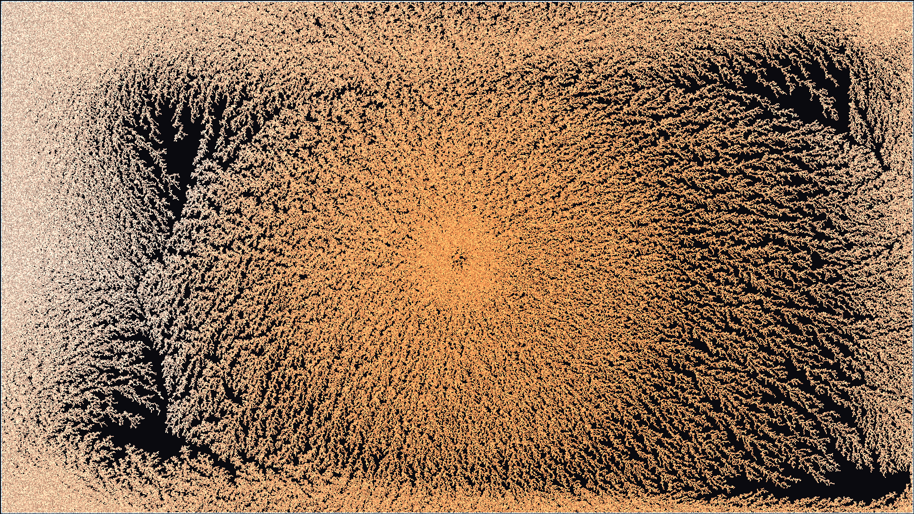

# electrodeposition_dendrite_growth

## Metadata
- **Date**: 2026-05-17
- **Theme**: **Theme**: The slow, beautiful electro-chemical growth of silver crystals branching out in a dark fl
- **Technique**: Unknown
- **Logic Lab Reference**: 

## Concept
**Theme**: The slow, beautiful electro-chemical growth of silver crystals branching out in a dark fluid under an electric field.

**Technique**: Vectorized pseudo-Diffusion-Limited Aggregation using a 150,000 particle system with continuous radial drift and random walk. Metallic age-based coloration mapped directly to the py5 P2D 3D ARGB pixel buffer with additive blending for electrolyte glow. 15s 4K/60fps MP4.

A single glowing seed in the center begins to rapidly branch out with intricate, frost-like fractal tendrils of shimmering silver and warm copper against a deep obsidian void, enveloped by an electric blue aura of migrating ions.

## Technical Details
- **Renderer**: P2D
- **Simulation**: Unknown
- **Visuals**: Unknown
- **Animation**: Contains animation details
