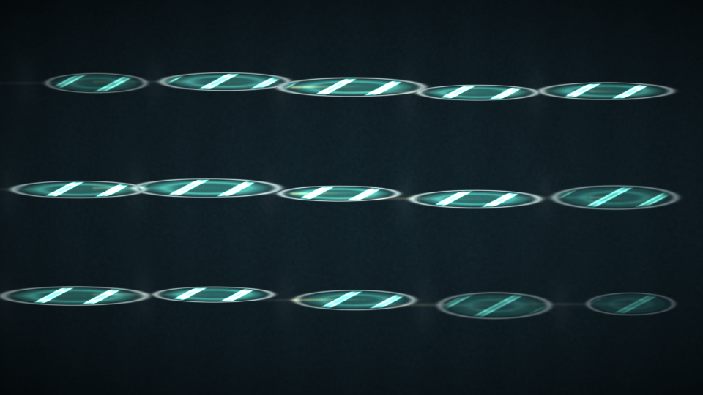

# electrowetting_lens_array

## Metadata
- **Date**: 2026-05-13
- **Theme**: Tiny droplets on conductive glass flattening under voltage pulses and bending light like adjustable micro-lenses.
- **Technique**: Vectorized electrowetting lens-field animation on a 960x540 grid, using pulsed elliptical droplet masks, rim highlights, caustic interference bands, electrode traces, voltage-memory glow, and direct py5 pixel-buffer rendering. 10s 4K/60fps MP4 generated as `output.mp4`.
- **Logic Lab Reference**: None

## Concept
A dark graphite slide holds an array of aquamarine droplets that breathe flatter and taller as voltage sweeps across them; silver rims and amber electrode memories reveal the hidden electrical control behind the shifting optical caustics.

## Technical Details
- **Renderer**: P2D
- **Simulation**: Vectorized electrowetting lens-field animation on a 960x540 grid, using pulsed elliptical droplet masks, rim highlights, caustic interferenc.
- **Visuals**: pixel-buffer rendering, bloom-like highlights.
- **Animation**: 10 seconds at 60fps
