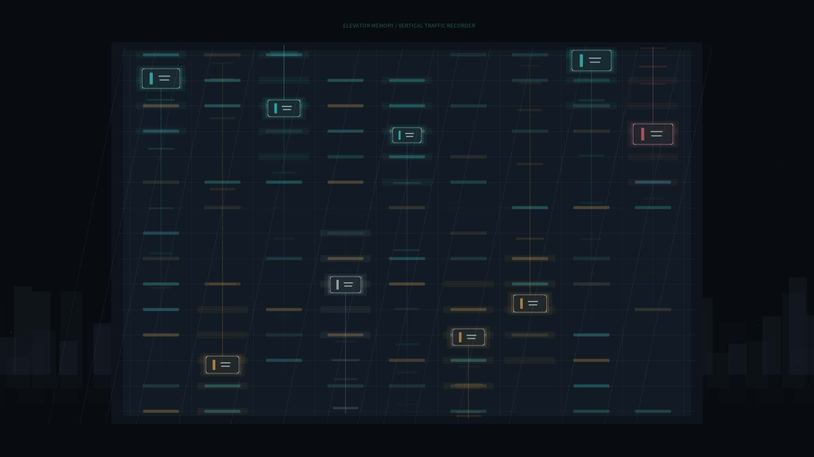

# elevator_memory

## Metadata
- **Date**: 2026-05-19
- **Theme**: A glass tower remembering every elevator trip as pale vertical traces in the night.
- **Technique**: Multi-shaft elevator choreography with eased triangular motion, fading path memory, stochastic window calls, parallax city silhouettes, and restrained glow passes.
- **Logic Lab Reference**: None

## Concept
`elevator_memory` turns a high-rise elevator bank into a quiet recorder of urban motion. Cabins rise and descend through a translucent facade while previous trips linger as thin luminous traces, suggesting that routine vertical traffic can become a hidden drawing made by the building itself.

## Technical Details
- **Renderer**: P2D
- **Simulation**: Procedural multi-cabin shaft system with smoothed triangular motion and stochastic call pulses
- **Visuals**: Cold graphite city background, glass facade grid, teal and amber cabin glows, pale path-memory trails
- **Animation**: 10 seconds at 60fps, generating `output.mp4` and `elevator_memory_p1.png`
