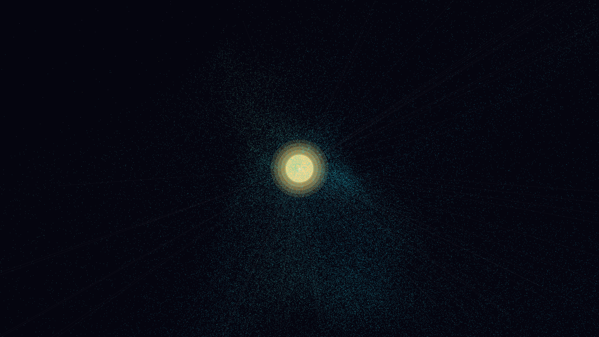

# entropic_dyson_swarm

## Metadata
- **Date**: 2026-05-06
- **Theme**: Megastructures, Dyson swarm, solar energy, orbital entropy, beautiful night sky.
- **Technique**: 3D orbital simulation (120,000 particles) using NumPy-vectorized Keplerian dynamics. Features "entropic drift" using Simplex-like noise perturbations to simulate gravitational instability. Multi-pass rendering for a pulsing solar core (60 units) and its corona glow. Particles are colored by orbital speed (Cyan to Gold) with additive blending. 60fps high-bitrate MP4 encoding.
- **Logic Lab Reference**: None

## Concept
A vast, shimmering megastructure in a deep indigo void; 120,000 collector mirrors swirl around a blindingly bright white-gold star, their paths tracing a chaotic yet organized dance of light that pulses with the energy of a distant civilization.

## Technical Details
- **Renderer**: P3D
- **Simulation**: NumPy, particle.
- **Visuals**: additive blending, bloom-like highlights, dark-field contrast.
- **Animation**: 10 seconds at 60fps
