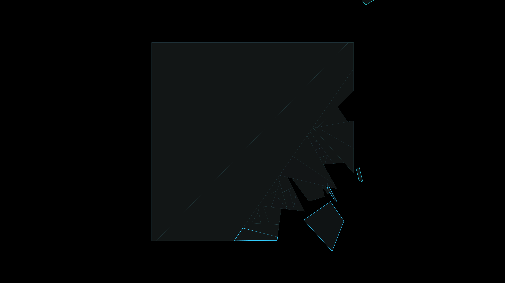

# entropic_monolith

## Metadata
- **Date**: 2026-05-04
- **Theme**: Digital entropy, decaying geometry, crystalline collapse, monolithic silence
- **Technique**: Recursive geometric polygon fragmentation, stochastic detachment logic, HSB edge-glow simulation, kinematic drift advection
- **Logic Lab Reference**: `mathematical/voronoi/voronoi.py` — used as a conceptual base for spatial partitioning and sharding

## Concept
A massive, obsidian-like monolith that stands in a pitch-black void, slowly being shattered by invisible entropic forces; hairline cracks of electric cyan appear across its surface as geometric shards break off, drifting away and dissolving into a fine mist of white light.

## Technical Details
- **Renderer**: P2D
- **Simulation**: Recursive geometric polygon fragmentation
- **Visuals**: stochastic detachment logic, HSB edge-glow simulation, kinematic drift advection
- **Animation**: 10s @ 60fps (typical)
