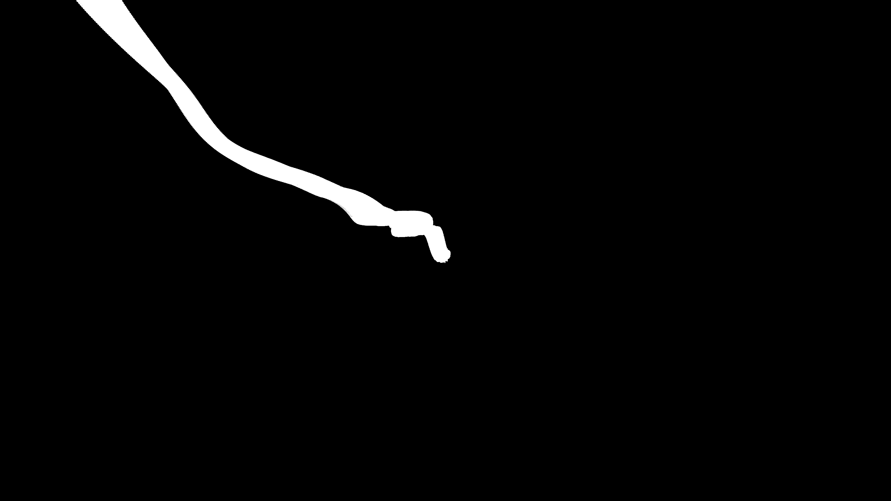

# ethereal_bioluminescent_mycelium_network_3d

## Metadata
- **Date**: 2026-06-17
- **Theme**: An animated sequence of a 3D agent-based curl-noise movement simulating mycelium growth using `py5
- **Technique**: 3D agent-based simulation where thousands of particles draw trails through an OpenSimplex curl-noise vector field, spontaneously branching into child particles to form an organic, tree-like structure. The color mapping creates a jade and cyan glow.
- **Logic Lab Reference**: 

## Concept
An animated sequence of a 3D agent-based curl-noise movement simulating mycelium growth using `py5.ADD` additive blending.

## Technical Details
- **Renderer**: Unknown
- **Simulation**: Unknown
- **Visuals**: Unknown
- **Animation**: Unknown
