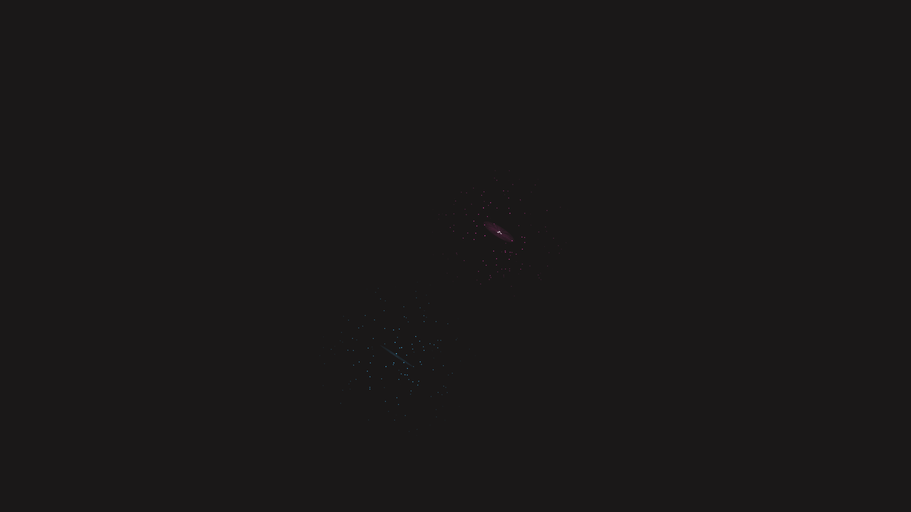

# ethereal_volumetric_fog_light_beams_3d

## Metadata
- **Date**: 2026-06-18
- **Theme**: - **Date**: 2026-06-18 - **Theme**: Glowing orbs illuminating a dense, volumetric fog in 3D space
- **Technique**: Unknown
- **Logic Lab Reference**: 

## Concept
- **Date**: 2026-06-18
- **Theme**: Glowing orbs illuminating a dense, volumetric fog in 3D space.
- **Technique**: Rendering 2,000 tiny dust particles floating in 3D space that light up when they enter the radius of two orbiting light spheres. This creates a beautiful volumetric illumination effect using `py5.blend_mode(py5.ADD)` and 3D Perlin noise for the dust motion.
- **Description**: An animated sequence of glowing particles reacting to moving light sources.

## Technical Details
- **Renderer**: Unknown
- **Simulation**: Unknown
- **Visuals**: Unknown
- **Animation**: Unknown
