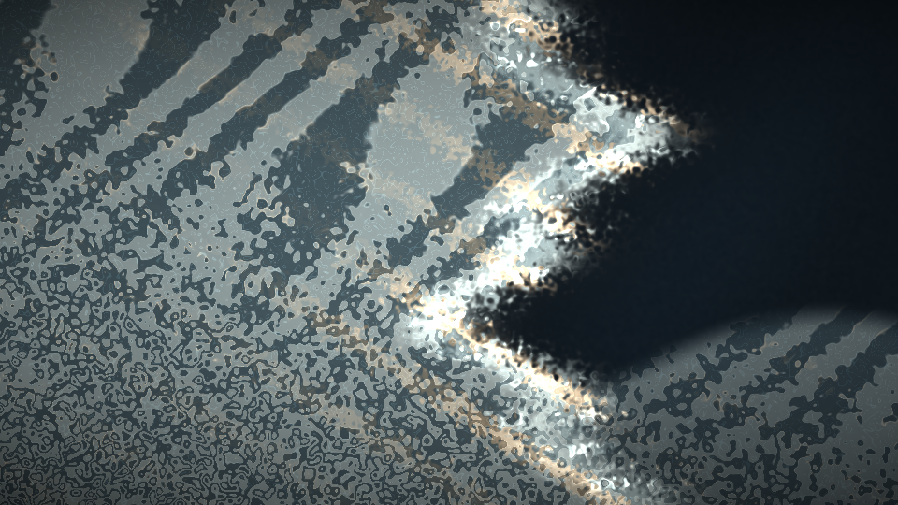

# eutectic_alloy_solidification

## Metadata
- **Date**: 2026-05-13
- **Theme**: A cooling alloy remembering pressure and impurity as pale eutectic lamellae freeze through a dark molten film.
- **Technique**: Vectorized phase-front solidification animation on a 960x540 grid, using anisotropic cooling fronts, oscillatory eutectic lamella masks, dendritic tip highlights, grain-boundary fields, solute-rejection memory, and direct py5 pixel-buffer rendering. 10s 4K/60fps MP4 generated as `output.mp4`.
- **Logic Lab Reference**: None

## Concept
Silver and pewter freezing fronts advance through an iron-blue melt, splitting into alternating lamellae while copper-rich impurity veins stay behind as a persistent memory of the solidification path.

## Technical Details
- **Renderer**: P2D
- **Simulation**: Vectorized phase-front solidification animation on a 960x540 grid, using anisotropic cooling fronts, oscillatory eutectic lamella masks, den.
- **Visuals**: pixel-buffer rendering, bloom-like highlights, dark-field contrast.
- **Animation**: 10 seconds at 60fps
