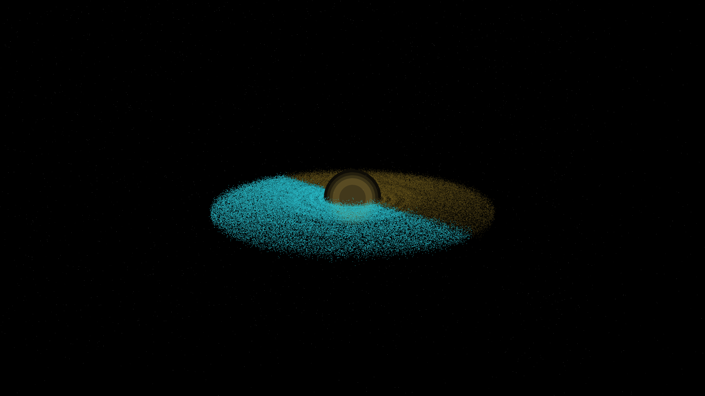

# event_horizon_echo

## Metadata
- **Date**: 2026-05-06
- **Theme**: Black hole, event horizon, accretion disk, Doppler shift, beautiful night sky.
- **Technique**: Relativistic particle simulation (130,000 particles) orbiting a central gravitational singularity. Particles follow Keplerian orbits with additional relativistic drag (1/r^4) and precession. Implements "Doppler beaming" where color and brightness are modulated by the orbital velocity relative to the camera (Approaching = Electric Cyan & Bright; Receding = Amber & Faint). Multi-pass rendering for the intense photon ring and the dark shadow of the event horizon. 60fps high-bitrate MP4 encoding.
- **Logic Lab Reference**: None

## Concept
A majestic and terrifying view of a supermassive black hole; a shimmering disk of light swirls around a perfect circle of absolute darkness, its colors shifting from electric blue to deep amber as it orbits at near-light speeds against a silent star-dusted void.

## Technical Details
- **Renderer**: P3D
- **Simulation**: particle.
- **Visuals**: HSB spectral mapping, bloom-like highlights, prismatic color, dark-field contrast.
- **Animation**: 10 seconds at 60fps
