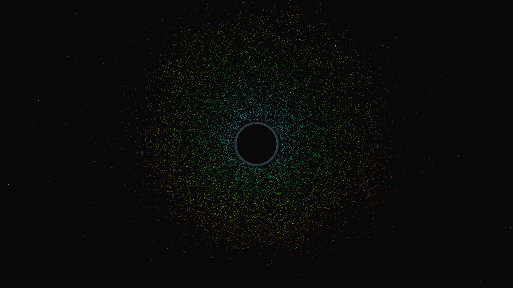

# event_horizon_shadow

## Metadata
- **Date**: 2026-05-05
- **Theme**: Black hole, event horizon, accretion disk, light warping, beautiful night sky.
- **Technique**: Accretion disk simulation (70,000 particles) with Keplerian orbits, Doppler-shift color mapping (HSB), dramatic gravitational lensing (Einstein ring approximation) on a star-dusted background, 60fps high-quality MP4 encoding.
- **Logic Lab Reference**: None

## Concept
A terrifyingly beautiful visualization of a supermassive black hole; light from the background stars is warped into a shimmering Einstein ring around the central shadow, while a high-energy accretion disk of electric cyan and molten orange plasma swirls at relativistic speeds.

## Technical Details
- **Renderer**: P3D
- **Simulation**: particle.
- **Visuals**: HSB spectral mapping, bloom-like highlights, prismatic color, dark-field contrast.
- **Animation**: 10 seconds at 60fps
