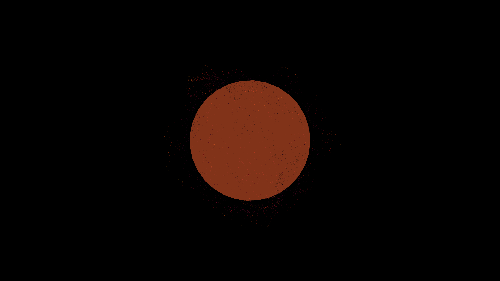

# fbm_displaced_stellar_core

## Metadata
- **Date**: 2026-05-27
- **Theme**: - **Date**: 2026-05-27 - **Theme**: A glowing, pulsing stellar core or alien sun
- **Technique**: Unknown
- **Logic Lab Reference**: 

## Concept
- **Date**: 2026-05-27
- **Theme**: A glowing, pulsing stellar core or alien sun. The surface undulates violently yet smoothly, resembling plasma.
- **Technique**: A 3D sphere constructed from latitude and longitude loops. Each vertex's distance from the center is modulated by summing multiple octaves of 3D Perlin noise (fBm), offset by time. Rendered as a glowing point cloud.
- **Description**: An animated 3D fbm displaced stellar core.

## Technical Details
- **Renderer**: Unknown
- **Simulation**: Unknown
- **Visuals**: Unknown
- **Animation**: Unknown
