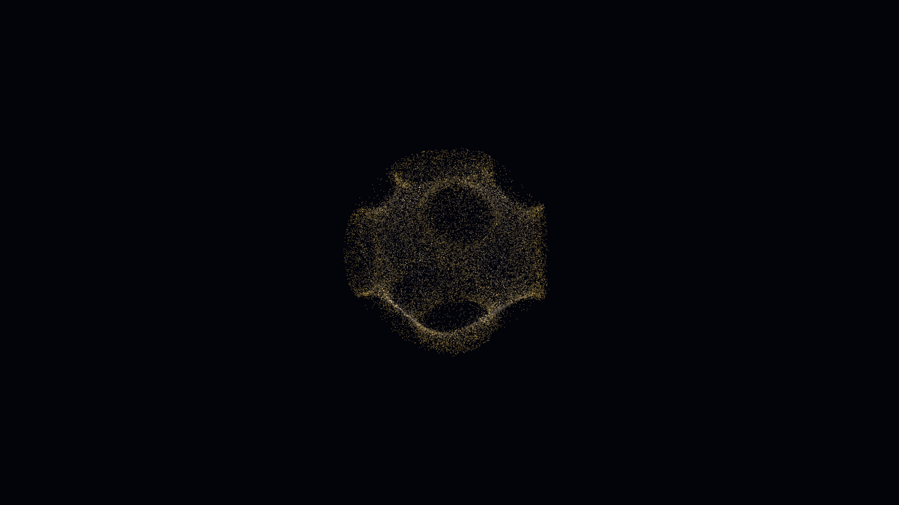

# fermi_surface_topology

## Metadata
- **Date**: 2026-05-16
- **Theme**: - **Theme**: Fermi Surface momentum-space geometry
- **Technique**: Unknown
- **Logic Lab Reference**: 

## Concept
- **Theme**: Fermi Surface momentum-space geometry.
- **Technique**: Vectorized 3D scalar field for Fermi surface approximation with particle advection constrained to the energy manifold and tight-binding mapping.
- **Description**: A shimmering, complex manifold of momentum states in electric cobalt and solar gold, illustrating the topological structure of electron energy in a crystal lattice.

## Technical Details
- **Renderer**: Unknown
- **Simulation**: Unknown
- **Visuals**: Unknown
- **Animation**: Unknown
