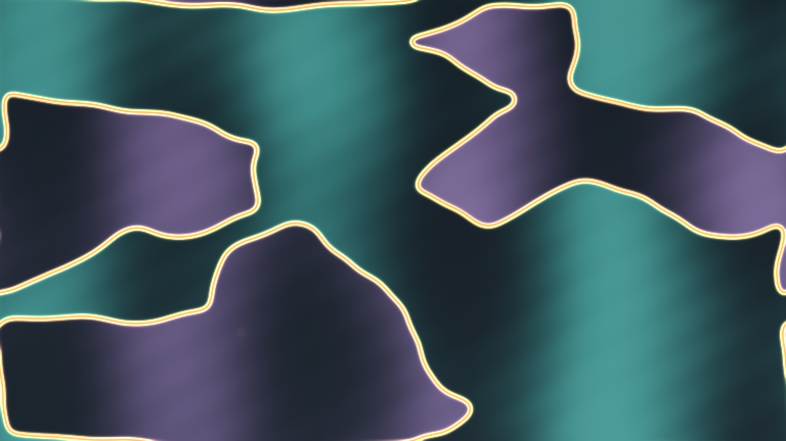

# ferroelastic_domain_drift

## Metadata
- **Date**: 2026-05-10
- **Theme**: polarized ferroelastic domains slowly drifting, locking, and leaving luminous boundary memories.
- **Technique**: Continuous 2D phase-field relaxation with pinning noise, slow external bias, and domain-wall memory extracted from field gradients. A rotating analyzer term maps domain orientation into restrained teal and violet polarization colors, while moving boundaries accumulate amber highlights. Direct NumPy-to-py5 pixel rendering. 10s 4K/60fps MP4.
- **Logic Lab Reference**: None

## Concept
Large teal and violet material domains slide under a dark polarizing field; their borders glow with thin amber light, creating a quiet microscopic view of crystal variants shifting and locking into place.

## Technical Details
- **Renderer**: P2D
- **Simulation**: NumPy.
- **Visuals**: HSB spectral mapping, prismatic color, dark-field contrast.
- **Animation**: 10 seconds at 60fps
