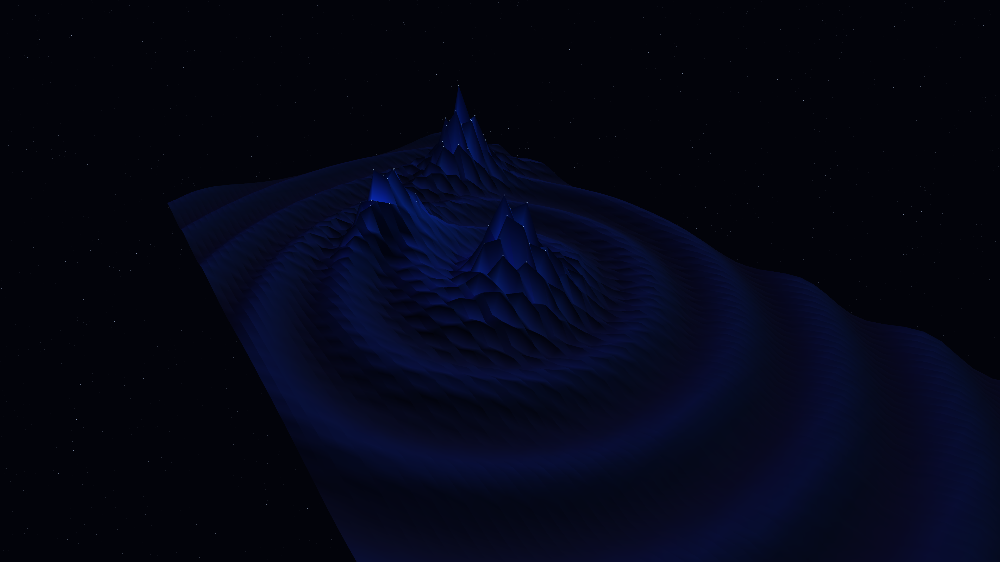

# ferrofluid_spikes

## Metadata
- **Date**: 2026-05-05
- **Theme**: Magnetic fluids, physical tension, alien architecture, beautiful night sky.
- **Technique**: 3D mesh deformation (P3D, 64x64 grid), magnetic field intensity simulation, Lissajous pole paths, multi-source specular lighting, bioluminescent cobalt highlights, 60fps high-quality MP4 encoding.
- **Logic Lab Reference**: None

## Concept
A dark, viscous liquid surface erupts into sharp, rhythmic spikes in response to moving magnetic poles, creating an alien architectural landscape of obsidian and electric cobalt under a star-dusted night sky.

## Technical Details
- **Renderer**: P3D
- **Simulation**: 3D mesh deformation (P3D, 64x64 grid), magnetic field intensity simulation, Lissajous pole paths, multi-source specular lighting, biolumines.
- **Visuals**: dark-field contrast.
- **Animation**: 10 seconds at 60fps
