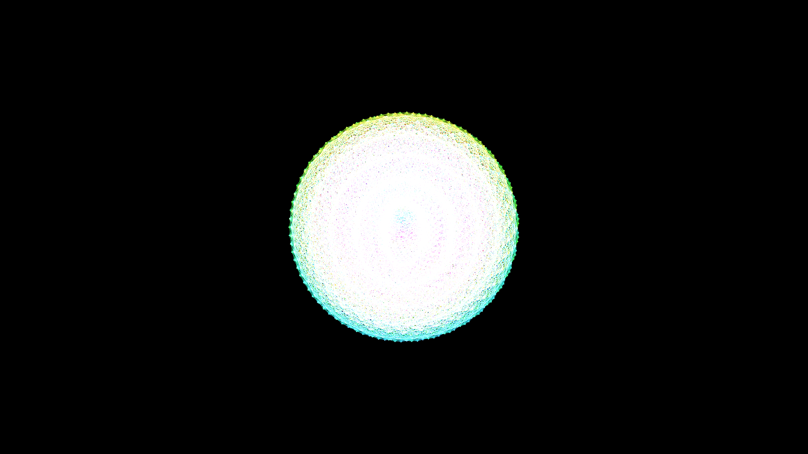

# fibonacci_lattice_sphere_3d

## Metadata
- **Date**: 2026-05-27
- **Theme**: - **Date**: 2026-05-27 - **Theme**: A mathematically perfect sphere made of interconnected glowing n
- **Technique**: Unknown
- **Logic Lab Reference**: 

## Concept
- **Date**: 2026-05-27
- **Theme**: A mathematically perfect sphere made of interconnected glowing nodes placed using the Fibonacci spiral. The sphere breathes and pulsates.
- **Technique**: A 3D mesh. Vertices are calculated using the Fibonacci sphere algorithm. Points that are close to each other in sequence are connected. The golden ratio parameter is animated to twist the spirals over time.
- **Description**: An animated 3D fibonacci lattice sphere.

## Technical Details
- **Renderer**: Unknown
- **Simulation**: Unknown
- **Visuals**: Unknown
- **Animation**: Unknown
