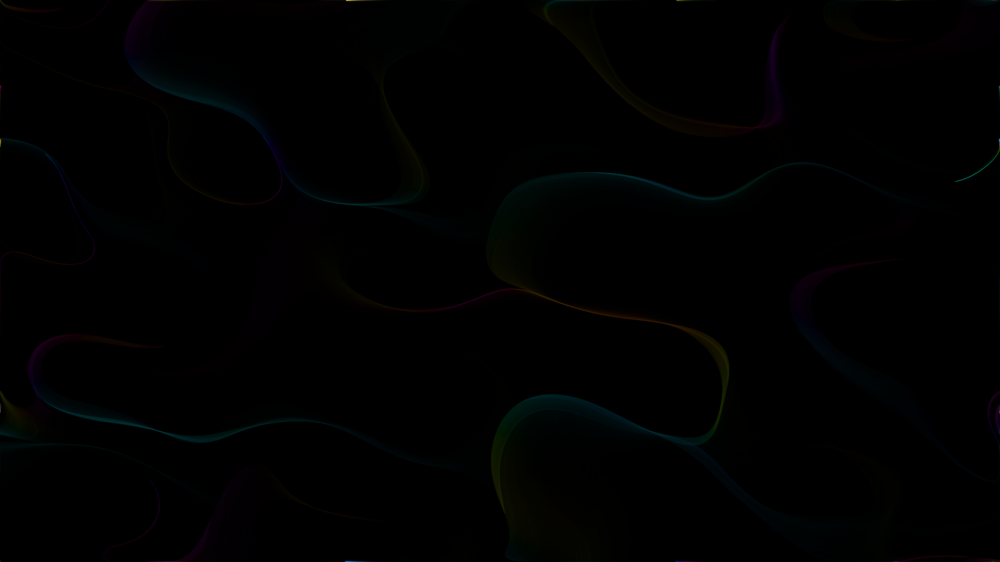

# Flow Field

80,000 particles drifting through a multi-frequency vector field built from layered sine and cosine functions. Particles converge onto emergent closed-loop orbits — limit cycles — tracing glowing stream lines reminiscent of plasma vortex rings or magnetic field lines on a deep black ground.
