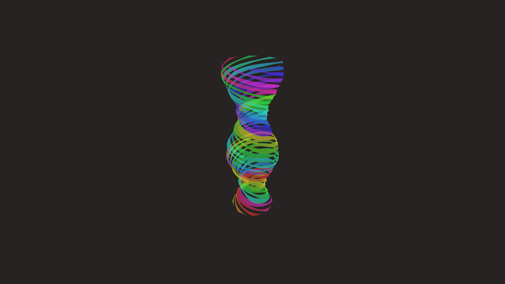

# fluid_chromatic_ribbon_vortex_3d

## Details
- **Date**: 2026-06-06
- **Format**: Animation (10s @ 60fps)
- **Theme**: A swirling vortex of thousands of thick, semi-transparent ribbons, each glowing with intense chromatic aberration, intertwining like a tornado of color in 3D space.

## Technique
Procedurally generated 3D ribbons using `QUAD_STRIP` with vertices displaced by 3D OpenSimplex noise and sine waves. Additive blending creates intense glowing colors based on the ribbon index and time.

